<h1 align="center">Aditya Pillai</h1>

Full-stack developer exploring AI systems, scalable applications, and developer tooling.

<a href="https://adityapillai.dev">Portfolio</a>
&nbsp;&nbsp;•&nbsp;&nbsp;
<a href="https://linkedin.com/in/aditya-pillai-dev">LinkedIn</a>
&nbsp;&nbsp;•&nbsp;&nbsp;
<a href="mailto:pillaiaditya2310@gmail.com">Email</a>

---

## // TECH STACK

### Languages

### Frameworks

### Databases

### Tools & Platforms

---

## // GITHUB METRICS

  

---

## // COMMIT CALENDAR

---

## // LANGUAGES

  

---

## // LEETCODE

  

---

## // NOTABLE CONTRIBUTIONS

  

---

  

