<h1 align="center">Hi 👋, I'm Aditya Pillai</h1>
<h3 align="center">Software Developer • B.Tech CSE @ VIT Chennai • Building AI & Full-Stack Applications</h3>

  <a href="https://adityapillai.dev">Portfolio</a> •
  <a href="https://linkedin.com/in/aditya-pillai-dev">LinkedIn</a> •
  <a href="mailto:pillaiaditya2310@gmail.com">Email</a>

---

## 💫 About Me

* 🎓 B.Tech CSE @ VIT Chennai
* 🏆 Rank 2 in CSE Core | CGPA: 9.72/10
* 💻 Full-Stack Developer with a strong interest in AI systems
* 🚀 Building products to learn by doing and solve real problems
* 🧠 Exploring Agentic AI workflows, multi-agent systems, and system design
* 📚 Solved 350+ DSA problems across LeetCode and competitive programming platforms

---

## 🛠️ Tech Stack

### Languages

### Frontend

### Backend & Databases

### Tools

---

## 📈 GitHub Metrics

## 📅 Commit Calendar

## 📌 Interests & Topics

## 🗳️ LeetCode

---

  

